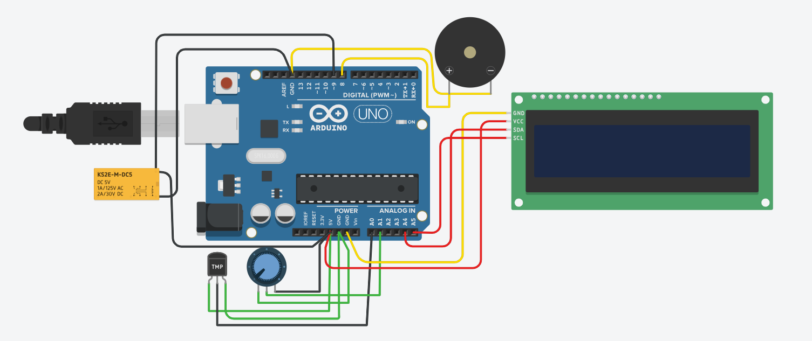
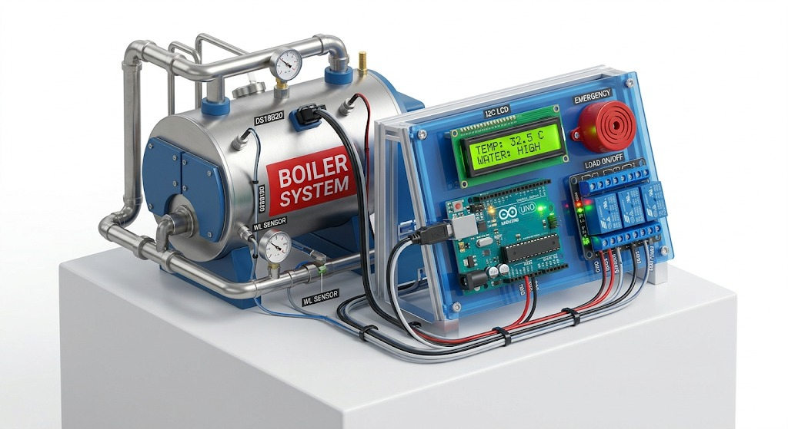

# 🔥 Smart Boiler Automation System

### ⚙️ Developed by Team DexterChem

---

## 🚀 Project Overview

The **Smart Boiler Automation System** is an embedded system simulation designed to ensure **safe and efficient boiler operation**.

It continuously monitors:

* 🌡️ Temperature
* 💧 Water Level

and automatically controls the system using intelligent decision logic.

---

## 🎯 Key Features

* 🔥 Automatic temperature control system
* 💧 Water level safety detection
* ⚡ Relay-based heater automation
* 🔔 Buzzer alert for critical conditions
* 🤖 Fully autonomous system (no manual control required)

---

## 🧰 Components Used

* Arduino UNO
* Temperature Sensor
* Water Level Sensor
* Relay Module
* Buzzer
* Jumper Wires

---

## ⚙️ System Working

The system operates based on real-time sensor inputs:

* If **temperature exceeds safe limit** → Heater OFF
* If **water level is LOW** → Buzzer ON
* If all conditions are normal → System runs efficiently

This ensures:

* ✅ Safety
* ✅ Energy efficiency
* ✅ Reduced human intervention

---

## 🔗 Live Simulation

👉 [Click here to view on Tinkercad](https://www.tinkercad.com/things/c9iCnbssfMI-bodacious-robo-snaget)

---

## 📸 Project Preview

### 🔌 Circuit Design



### ⚙️ Simulation Output



---

## 💻 Source Code

```bash
main.ino
```

---

## 📁 Project Structure

```bash
DexterChem/
│
├── code/
│   └── main.ino
├── images/
│   ├── preview.png
│   └── preview2.png
└── README.md
```

---

## 🧠 Skills Gained

* Embedded Systems Basics
* Sensor Integration
* Real-time Logic Implementation
* Automation System Design

---

## 🔮 Future Enhancements

* 📟 LCD Display Integration
* 🌐 IoT-based Remote Monitoring
* 📱 Mobile App Control
* 📊 Data Logging System

---

## 👥 Team DexterChem

### 🧑‍💻 Members

* **Abhishek Kumar Dutta**
* **Pawan Kumar Agarwal**
* **Preeti Paul**
* **Payal Kumari**

---

## 🏆 Contribution

This project was collaboratively built with contributions in:

* Circuit Design
* Logic Development
* Testing & Simulation
* Documentation

---

## ⭐ Show Your Support

If you like this project, give it a ⭐ and share it!

---

## 💬 Final Note

This project represents a practical implementation of **automation and safety systems**, simulating real-world industrial boiler control.
